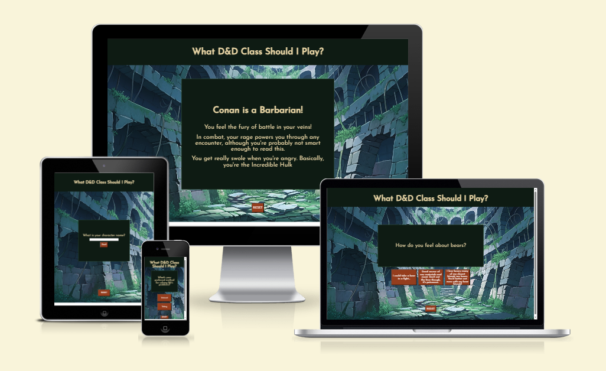
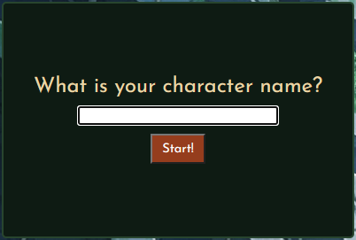
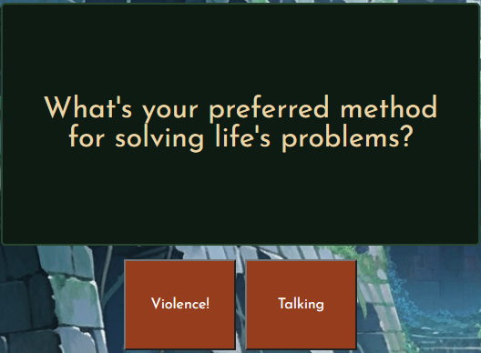
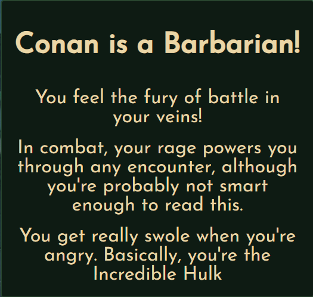
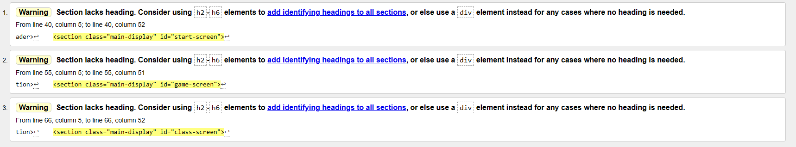

# Dungeons & Dragons Class Picker

The [D&D Class Picker](https://jfpaliga.github.io/dnd-class-picker/) website is a page built for those who play or are interested in playing the tabletop role-playing game, Dungeons & Dragons.

The goal of this site is to provide users with a fun quiz, where the user will answer a series of questions with answers they feel suit them best, and at the end of the quiz they are provided with a class to play and a tongue-in-cheek description of that class.

Users will enter a character name at the beginning of the quiz in an entry form, then interact with the quiz through a series of buttons before reaching the solution page.

The target audience would be users who already have an interest in Dungeons & Dragons, and either want to try the quiz for fun or use it to give them an idea of what type of character they could play.

## Features

- Page Heading

  - A large heading at the top of the page which gives a clear indication of what the purpose of the website is.

- Start Screen

  - Provides a text input that allows the user to enter a character name.
  - A focus method called on the text input means that the user can type straight away into the input field without first selecting it.
  - Hitting the 'Start!' button will begin the quiz and take a user to the first question.

- Question Screens

  - Provides the user with a question and a series of buttons with potential answers.
  - Selecting one of the buttons will take the user to another question dependent on their answer, or if the answer is the last one in a chain it will take them to the solution screen.

- Solution Screen

  - Returns the character name entered at the beginning of the quiz with a statement that tells the user what class they are.
  - Also provides a tongue-in-cheek description about that class and some of the abilities they might have during the game.

- Reset Button

  - Located at the bottom of each page.
  - The button will clear all answers and return the user to the start screen.

## Testing

### Validator Testing

- HTML

  - No errors were returned when passing through the official W3C validator.
  - Three warnings were given regarding the use of sections with no headings, however as all the content within each section was related I believe it is still the appropriate semantic element to use.

  

- CSS

  - No errors were returned when passing through the official W3C Jigsaw validator.

- JavaScript

  - No errors were returned when passing through the official Jshint validator.
  - The following metrics were returned:
    - There are 10 functions in this file.
    - Function with the largest signature take 1 arguments, while the median is 1.
    - Largest function has 11 statements in it, while the median is 4.
    - The most complex function has a cyclomatic complexity value of 4 while the median is 1.

## Bugs

## Deployment

- The website was deployed using GitHub Pages. The steps to deploy were taken as follows:

  - From the GitHub repository, navigate to the Settings tab.
  - On the nav menu on the left hand side, navigate to Pages.
  - From the Source dropdown menu, select 'Deploy from a branch'.
  - From the Branch dropdown menu, select 'main'.
  - Once these have been selected, click Save and GitHub provides a link to the website.

## Credits

### Content

- The text content and flow design was taken from [this](https://www.reddit.com/r/DnD/comments/cbxw9f/class_selection_chart_now_with_extra_warlock/) reddit page by user u/vaz_de_firenze.

### Media

- The background image was taken from [itch.io](https://ezekiel-eastbrook.itch.io/1000-magical-fantasy-anime-visual-novel-backgrounds) created by Ezekiel Eastbrook.